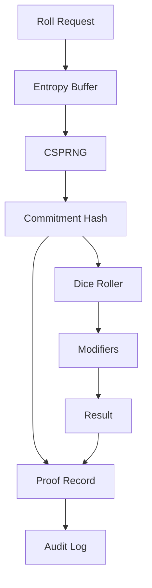

# Dice-Engine Architecture

> Agent context artifact for the CSPRNG dice roller.

## Purpose

Cryptographically secure dice roller with entropy proofs for transparent, auditable randomness in competitive play.

## Technology Stack

- **Language**: Python 3.11+
- **Crypto**: `secrets` module (CSPRNG)
- **Proofs**: SHA-256 commitment scheme

## Directory Structure

```
├── src/dice_engine/
│   ├── roller/         # Core dice rolling
│   ├── entropy/        # Entropy source management
│   ├── proofs/         # Commitment/reveal scheme
│   ├── combat/         # Combat sequence builder
│   └── modifiers/      # Re-rolls, exploding dice
├── tests/
└── docs/
```

## Component Graph



## API Surface

```python
from dice_engine import roll, CombatSequence

# Simple roll
result = roll("2d6+3")

# Combat sequence (fluent)
sequence = (
    CombatSequence()
    .hit_roll(10, skill=3)
    .wound_roll(hits, strength=4, toughness=4)
    .save_roll(wounds, save=3, ap=2)
    .execute()
)
```

## Entropy Proofs

Each roll generates a verifiable proof chain.
